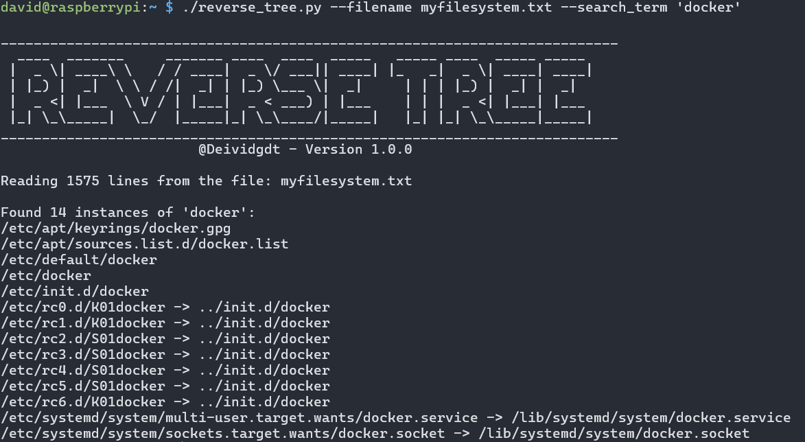

[](https://ko-fi.com/U7U01LTQB)

# Reverse / Search Tree Script

>A script to reverse a tree (command) output to absolute paths



This Python script searches for paths in a file tree structure and prints the paths that contain a specified search term. It removes any color codes from the tree output and handles the depth of the tree structure to build the correct paths.

## Usage

The script can be run from the command line. It takes the following arguments:

- `--filename`: The file containing the tree structure to search within.
- `--search_term`: The term to search for in the paths.
- `--verbose`: (Optional) Enable verbose output.

### Example

```sh
./tree_search.py --filename tree.txt --search_term my_search_term --verbose
```

## Functions

### `print_banner()`

Prints a banner with the script information.

### `remove_color_codes(line)`

Removes any color codes from the given line.

### `replace_blank_spaces(line)`

Replaces four blank spaces with `[b]` to calculate the current depth of the tree.

### `process_line(line)`

Processes the given line to remove color codes and replace blank spaces.

### `calculate_depth(line)`

Calculates the current depth of the tree structure from the given line.

### `handle_depth_change(stack, current_depth, last_depth, lastchar)`

Handles changes in the depth of the tree structure.

### `build_paths(filename, search_term, verbose=False)`

Builds the paths from the tree structure and prints the paths that contain the search term.

### `parse_arguments()`

Parses command-line arguments using the `argparse` module.

### `main()`

The main function that orchestrates the script execution.

# To-do
- A bug has been detected when working with a file with five milllion lines. Waiting fix.
- Create directories structure from the input file
- Show all the paths without providing a search_term
